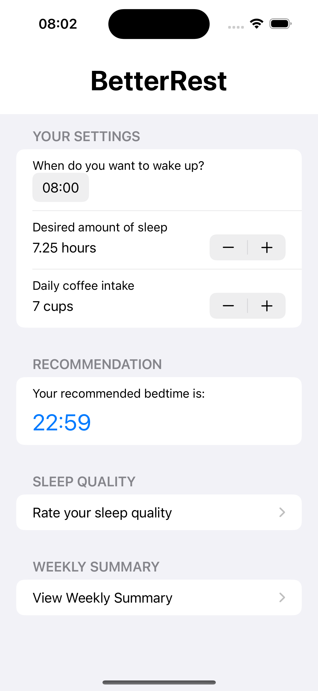
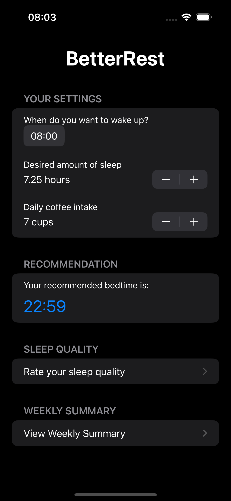

# BetterRest

BetterRest is a simple SwiftUI app designed to help you improve your sleep quality by calculating the optimal bedtime based on your wake-up time, desired sleep duration, and coffee intake.

## Features

- **Bedtime Recommendation**: Enter your wake-up time, desired sleep duration, and daily coffee intake to receive a personalized recommendation for your bedtime.
- **Rate Sleep Quality**: Keep track of your sleep quality by rating your sleep experience and adding optional comments.
- **Weekly Summary**: View a summary of your sleep data for the past week, including sleep quality ratings and comments.

## Main Technologies:

`Swift`
`SwiftUI`

## How to Use

1. Launch the app and enter your preferred wake-up time, desired sleep duration, and daily coffee intake.
2. Receive a personalized recommendation for your bedtime based on the entered information.
3. Rate your sleep quality and add comments to track your sleep experience.
4. View a summary of your sleep data for the past week to monitor your sleep habits and make adjustments as needed.

## Installation

1. Clone the repository:
   ```bash
   git clone https://github.com/devkilyungi/BetterRest.git
   ```
2. Open the project in Xcode.

3. Build and run the project on your simulator or device.

## Core ML Integration

The app utilizes a Core ML model to predict the optimal bedtime. The model takes into account the user's wake-up time, desired sleep duration, and coffee intake to provide a personalized recommendation.

## Acknowledgements

- This project was created as a learning exercise to understand the integration of Core ML and Create ML in SwiftUI projects.
- Inspired by the "BetterRest" project from the 100 Days of SwiftUI course by Paul Hudson.

## Author

- Victor Kilyungi

## Demo Images and Video:

https://github.com/devkilyungi/BetterRest/assets/99484519/934e0804-6adf-4283-9c1e-f667834931c7

<div style="flex: 1; text-align: center;">
  <p>Home Screen</p>
  
</div>

<div style="flex: 1; text-align: center;">
  <p>Home Screen</p>
  
</div>
